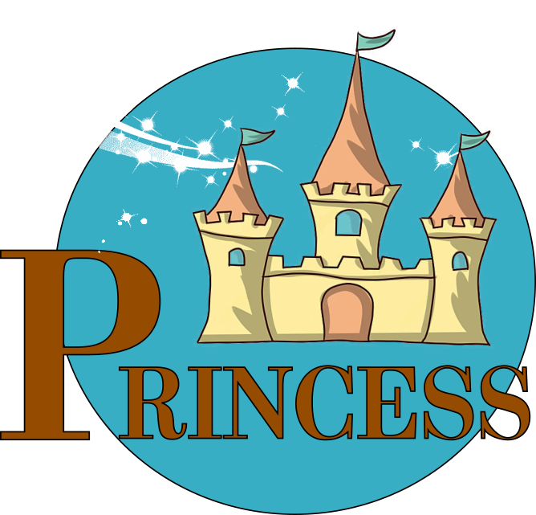

_**Princess** is program developed by Carole Perigois ([carolperigois@outlook.com](mailto:carolperigois@outlook.com)), with the support of from the European Research Council for the ERC Consolidator grant DEMOBLACK, under contract no. 770017._

    

# Princess
**Predicting tool for CBC GW observations**

Nowdays LIGO-Virgo-KAGRA observatiories reported a catalogue of 98 candidates for compat binary coalescences (CBCs) ([Link to portal events](https://www.gw-openscience.org/eventapi/), [GWTC-2.1](https://inspirehep.net/literature/1897574), [GWTC-3](https://inspirehep.net/literature/1961691))
The sensitivities of these instruments will improve in the next years and new detectors will be built such as Einstein Telescope (ET), Cosmic Explorer (CE) or LISA, increasing the number of candidate. 
These instruments are providing two observation channel for CBCs: The individual events, already detected from which we get information such as the masses and spins of the components, the distance, etc. and the astrophysical background not measured yet and defined to be the superposition of all astrophysical sources not individually resolved.

**PRINCESS** is the first tool aiming to join these to observation channel to constrain stellar formation and evolution models. 
This first version of the program aims to predict the background and individual observation from any astrophysical catalogue of CBCs for different detector networks. This program can be refered in publications with the following paper (_in. prep_). Developpers would like the tool to be userfriendly and interactive, so please for any questions or improvement suggestion contact Carole Perigois ([carolperigois@outlook.com](mailto:carolperigois@outlook.com)). 

This document is briefly introducing the requirement, the organisation of the program as well as the _GettingStarted_ files. This project is linked to a more complete wiki page and a publication on arXiv which will be updated frequently (v1 in prep).

## Introduction and basic use: Getting_Started.py

### Requierment
This program has been made and tested with Python 3.6.
This code is used with the following packages, please make sure all of them are installed with the right version.

### First use of the code: _Getting_Started_

For a first use a pre-made code(notebook) Getting_started.py(.ipy) contains a full  guide line for the calculation of the background from the preparation of the catalogues to the analysis of the obtained background. Getting_Started.py also gather all the parameter needed for the future analysis.

### Structure of the code.

**Entry Files**  

AuxiliaryFiles: Contains all the files related to the detection files 
* Overlap reduction functions(ORFs)
* Power spectral densities (PSDs)
* Power integrated curves (PICs)

**Catalogs**  
Catalogs: contains all the catalogs made by the program. The _Ana_xxx.txt_ files contains the basic statistics about the _xxx.txt_ catalog.

**Packages**  
* Princess.Starter: This package contains functions to load your astrophysical catalogue and make it usable with Princess.stochastic  
* Princess.Stochastic: Make prediction on the astrophysical gravitational wave background.  
* Princess.AuxiliaryPacks: All useful package as constants or basic functions. 

**Results**
Results files will have the same names as the catalogs it refers to. 
* Results/Analysis/: contains the files made by the analysis set up by the user from Getting_Started

## Princess.Starter

**Content**
* AstroModel.py: AstroModel class and method
* Detection.py: Contain all classes and methods related to the detection.
* Htild.py: Calculation of the frequency domain waveform

## Princess.stochastic

**Content**
* Princess.py: Tools to calculate the background of a catalogue
* SNR.py: Calculation of the SNR of a given background

## Princess.AuxiliaryPacks

**Content**
Basic_function.py: All basic function useful
Kst.py: contain the constants used in the program
Pix.py: contains the drawings appearing in the code

